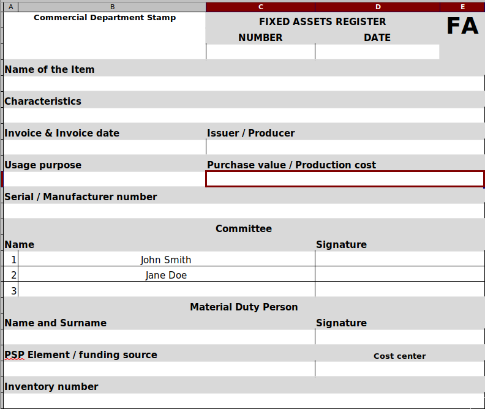

# Fixed Assets Register

## Purpose

Written for my wife, entirely in Python, a small program designed to help her and her unit to keep track of their **fixed asset documents**.

The whole idea is based on a premise: *"Excel is everywhere"*. Well, I wouldn't know but in short, this is what this program does: It imports data from an Excel file and stores it in a simple, pickle-formatted DB file. When need a fixed asset document is created, which of course is yet another Excel file. :smiley:

For me it was also an opportunity to create an entry in my portfolio to present some python techniques used, like pooling or ...

```python
    for row in rows:
        yield {key: row[index] for key, index in INDEXES.items()}
```

... working with a generator while remapping excel's rows to dictionaries - a preferred, pythonic way to present data structures.

It utilizes the power of Openpyxl and Pydantic.

The picture below shows how such document looks like.



### Installation

Make sure you have Python installed, the program runs with version 3.10+. Then simply go through the steps below.

1. Clone this repository with:
```sh
   git clone github.com/MarekSzadkowski/Fixed-Assets-Register.git
```
This will create Fixed-Assets-Register directory with files downloaded from Github. If you don't have git installed on your computer, just install it or copy the files from here.

2. Go to this directory:
```sh
   cd Fixed-Assets-Register
```
3. Create Python's environment:
```sh
   python -m venv .env
```
4. Activate it - on Linux and Mac:
```sh
   source .env/bin/activate,
```
on Windows:
```sh
   .env\Scripts\activate
```
5. Install requirements:
```sh
   pip install -r requirements.txt
```

Voila! You are ready to go.

### Usage

On Linux and Mac just run it: ./main.py \[parameter\], on Windows however you must use: python main.py \[parameter\]

First run the program with the **config** parameter. It will create a settings file called settings.txt

Then import data from a workbook, issuing ./main wb and/or ./main fa respectively.

As you saw above you may skip a parameter, in this case the program would call the report function which dumps the content of DB to the screen. However if no data exists yet, it stops with according message.

### TODO

1. Search function
2. Parameterization of fa parameter - it can NOT create just 1 or 2 documents yet, probably giving it a better name.

### Known issues

ATM the program does its purpose, there are however some issues related to new fields added to workbook, therefore all tests related to Pydantic will fail now.

register.models.py, line 22: COMMITTEE - it is defined but not used anywhere - its usability is questionable ATM.

If you happen to find a bug please fil free to file it through Issue button above.

### Tweaking the program

If you would like to modify the program to import your excel-generated documents, just modify **INDEXES** in register.wordbook.py according to your needs. Modifying the FixedAsset class (register.models.py) and its validation methods may be needed too.
